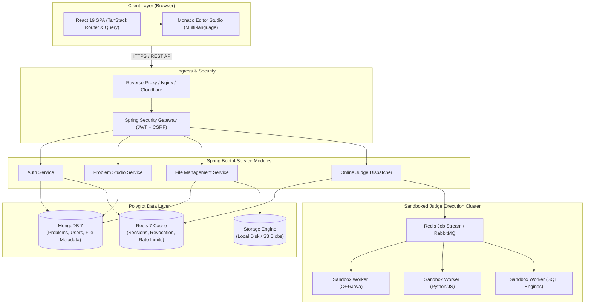
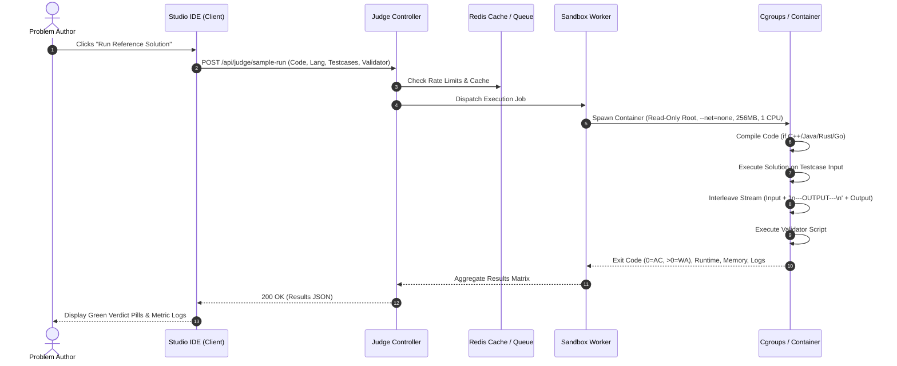

# High-Level Design (HLD)

## Project: Stacked — High-Performance Coding Assessment & Online Judge Platform

**Document Version:** 1.0.0  
**Status:** Approved  
**Architect:** Stacked Engineering Architecture Team

---

## 1. System Overview & Architectural Objectives

Stacked is designed as a cloud-ready, enterprise-grade assessment platform providing seamless problem authoring, instant code execution feedback, and high-concurrency evaluation.

### Key Architectural Tenets:

1. **Zero-Trust Code Execution**: User code must run in ephemeral, isolated sandboxes with no host privileges or network access.
2. **Deterministic Evaluation**: Testing must produce repeatable, verifiable verdicts with microsecond-resolution timing.
3. **Polyglot Persistence**: Matching storage paradigms to access patterns (document flexibility for problems, in-memory speed for sessions/tokens).
4. **Author Ergonomics**: Single-page, zero-scroll IDE environments reducing cognitive load during problem curation.

---

## 2. Global Architecture & Component Topology

The system adopts a layered modular architecture with decoupled client, stateless application backend, polyglot persistence, and containerized worker pools.

---

## 3. Subsystem Architectural Specifications

### 3.1 Authentication & Session Subsystem

- **Stateless Access with Sticky Refresh**: The client stores a short-lived JWT in memory for Authorization headers. A cryptographically random refresh token resides inside a `Secure`, `HttpOnly`, `SameSite=Strict` cookie (`__Host-refreshToken`).
- **Immediate Token Revocation**: When an administrator logs out or revokes access, the JWT JTI (JWT ID) is written to Redis with an automatic TTL expiring when the token naturally lapses.
- **RBAC Enforcement**: Method-level security (`@PreAuthorize("hasRole('ADMIN')")`) protects administrative endpoints.

### 3.2 Problem Studio Subsystem (Frontend & Backend)

The Problem Studio uses a state-machine driven two-step workflow managed via Zustand (`useCodingProblemStore`):

- **Step 1: Problem Details**: Collects canonical metadata (Title, Slug, Category, Difficulty, Supported Languages, KaTeX Markdown Description, and Sample Testcases).
- **Step 2: IDE Solutions & Validation Workbench**: A fixed full-viewport workspace (`h-screen overflow-hidden`) with resizable Monaco panels:
  - Top Left: Reference Solution & Starter Code tabs.
  - Bottom Left: Solution Validator Script editor.
  - Right: Synchronized Testcases authoring & real-time verification console.

### 3.3 Ephemeral & Permanent File Lifecycle Subsystem

To prevent orphan image files from accumulating in cloud storage:

1. **Stage 1 (Ephemeral Upload)**: Images pasted into Markdown are uploaded to `POST /api/files/upload/temp` and tagged with `storageType = TEMPORARY` and `expiresAt = Instant.now() + 24h`.
2. **Stage 2 (Permanent Promotion)**: When the author clicks "Save & Publish", `PUT /api/files/make-permanent` converts the referenced file IDs to `storageType = PERMANENT` (`expiresAt = null`).
3. **Stage 3 (Automated Garbage Collection)**: `FileCleanupScheduler` runs periodically (`@Scheduled(cron = "0 0 * * * *")`), querying MongoDB for `expiresAt < now()`, deleting physical files from the storage driver, and removing metadata records.

### 3.4 Online Judge & Execution Subsystem

The Online Judge service handles compilation, sandbox provisioning, testcase execution, output capture, and validator evaluation.

---

## 4. Data Architecture & Polyglot Persistence Strategy

Stacked pairs **MongoDB** and **Redis** to exploit their complementary performance profiles:

| Dimension             | MongoDB                                                                       | Redis                                                  |
| --------------------- | ----------------------------------------------------------------------------- | ------------------------------------------------------ |
| **Role**              | System of Record (Primary Persistent Store)                                   | High-Speed Cache & In-Memory Coordination              |
| **Data Types Stored** | Users, Problem Documents, Testcases, File Metadata                            | Token Revocation Sets, Rate Limits, Runner Queues      |
| **Consistency**       | Strong Consistency (Write Concern `majority`)                                 | Eventual / In-Memory (Optional AOF persistence)        |
| **Access Pattern**    | Query by ID, Slug, Tag indexing, Aggregations                                 | Key-Value lookups (`O(1)`), Sets (`O(1)`), TTL Expiry  |
| **Rationale**         | Problems have flexible schemas (DDL scripts, Markdown, dynamic language maps) | Token validation must add `< 2ms` latency per API call |

---

## 5. Security & Threat Modeling

| Threat Category                 | Potential Attack Vector                                                               | Architectural Mitigation                                                                                                       |
| ------------------------------- | ------------------------------------------------------------------------------------- | ------------------------------------------------------------------------------------------------------------------------------ |
| **Remote Code Execution (RCE)** | Candidate code attempts system shell calls (`fork()`, `rm -rf /`, `cat /etc/passwd`). | Isolated Linux namespaces (PID, Mount, IPC, Network). Unprivileged user (`uid 10001`). No network bridge.                      |
| **Denial of Service (DoS)**     | Fork bombs or infinite loops consuming all CPU and memory.                            | Kernel cgroups v2 enforce `pids.max = 64`, `memory.max = 256M`, and hard execution timeout (`SIGKILL` after $T_{limit} + 1s$). |
| **Data Exfiltration**           | Submitting network sockets or DNS tunnels to transmit internal test data.             | Sandbox containers instantiated with `--network none`. No network interfaces except local loopback.                            |
| **Session Hijacking / XSS**     | Theft of authentication credentials from browser LocalStorage.                        | Tokens stored in HTTP-only, Secure, SameSite=Strict cookies inaccessible to JavaScript.                                        |
| **Storage Flooding**            | Attacker repeatedly uploading multi-megabyte images without creating problems.        | Enforced file size limits (5MB), MIME validation, rate-limiting, and 24-hour automated TTL cleanup.                            |

---

## 6. Scalability & Resilience

1. **Stateless Service Scale**: The Spring Boot backend stores no session state in heap memory. Multiple instances can sit behind a round-robin load balancer.
2. **Worker Cluster Autoscale**: Sandboxed runner nodes can scale dynamically based on Redis execution queue depth.
3. **Graceful Degradation**: If the Redis cache fails, the authentication filter falls back to database user lookup while alerting SRE.
