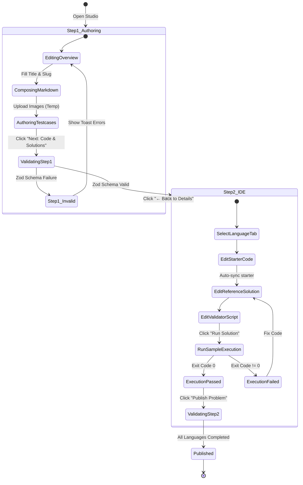

# Low-Level Design (LLD)

## Project: Stacked — High-Performance Coding Assessment & Online Judge Platform

**Document Version:** 1.0.0  
**Status:** Approved  
**Author:** Stacked Engineering Architecture Team

---

## 1. Introduction

The Low-Level Design (LLD) specifies the concrete implementation architecture for **Stacked**, detailing class hierarchies, method signatures, database schemas, REST payloads, frontend state machines, and core evaluation algorithms.

---

## 2. Backend Class Design & Object Model

The backend is built with **Spring Boot 4.1.1** and **Java 25**, adopting a strict layered architecture: Controller $\rightarrow$ Service $\rightarrow$ Repository $\rightarrow$ Database.

```mermaid
classDiagram
    direction TB

    class AuthController {
        -AuthService authService
        +loginAdmin(AdminLoginRequest, HttpServletResponse) ResponseEntity~ApiResponse~AuthResponse~~
        +refreshToken(HttpServletRequest, HttpServletResponse) ResponseEntity~ApiResponse~RefreshResponse~~
        +logout(HttpServletRequest, HttpServletResponse) ResponseEntity~ApiResponse~Void~~
        +getCurrentUser(CustomUserDetails) ResponseEntity~ApiResponse~AdminResponse~~
    }

    class AuthService {
        <<interface>>
        +loginAdmin(AdminLoginRequest, HttpServletResponse) AuthResponse
        +refreshToken(String, HttpServletResponse) RefreshResponse
        +logout(String, String, HttpServletResponse) void
        +getCurrentUser(String) AdminResponse
    }

    class AuthServiceImpl {
        -UserRepository userRepository
        -PasswordEncoder passwordEncoder
        -JwtTokenProvider jwtTokenProvider
        -CookieUtil cookieUtil
        -RedisService redisService
    }

    class FileController {
        -FileService fileService
        +uploadTempFile(MultipartFile, CustomUserDetails) ResponseEntity~ApiResponse~FileResponse~~
        +makePermanent(String, CustomUserDetails) ResponseEntity~ApiResponse~Void~~
        +getFile(String) ResponseEntity~Resource~~
        +deleteFile(String, CustomUserDetails) ResponseEntity~ApiResponse~Void~~
    }

    class FileService {
        <<interface>>
        +uploadFile(MultipartFile, String, FileStorageType) FileResponse
        +makePermanent(String, String) void
        +getFileContent(String) FileContent
        +deleteFile(String, String) void
        +cleanupExpiredFiles() int
    }

    class FileServiceImpl {
        -FileMetadataRepository fileMetadataRepository
        -FileProperties fileProperties
        -StorageDriver storageDriver
    }

    class RedisService {
        <<interface>>
        +set(String, Object, long, TimeUnit) void
        +get(String, Class~T~) Optional~T~
        +delete(String) boolean
        +hasKey(String) boolean
    }

    class User {
        +String id
        +String name
        +String email
        +String password
        +Role role
        +Instant createdAt
        +Instant updatedAt
    }

    class FileMetadata {
        +String id
        +String originalFileName
        +String storedFileName
        +String contentType
        +long size
        +FileStorageType storageType
        +String storagePath
        +String ownerId
        +Instant createdAt
        +Instant expiresAt
    }

    AuthController --> AuthService
    AuthServiceImpl ..|> AuthService
    FileController --> FileService
    FileServiceImpl ..|> FileService
    AuthServiceImpl --> RedisService
    AuthServiceImpl --> User
    FileServiceImpl --> FileMetadata
```



---

## 3. Database Schemas & Collection Specifications

### 3.1 MongoDB: `users` Collection

Stores administrative and candidate credentials with unique indexing on email.

```json
{
  "_id": { "$oid": "66e2a1b9f1a23c4d5e6f7a8b" },
  "name": "Platform Administrator",
  "email": "admin@stacked.dev",
  "password": "$2a$12$e8Y5M9... (BCrypt hash, cost factor 12)",
  "role": "ADMIN",
  "createdAt": { "$date": "2026-09-12T00:00:00.000Z" },
  "updatedAt": { "$date": "2026-09-12T00:00:00.000Z" }
}
```

**Indexes**:

- `{ "email": 1 }` (Unique constraint)

---

### 3.2 MongoDB: `files` Collection

Tracks ephemeral and permanent file metadata with automatic TTL indexing.

```json
{
  "_id": { "$oid": "66e2c3a5f1a23c4d5e6f7a9c" },
  "originalFileName": "binary-search-tree.png",
  "storedFileName": "f9a1b2c3-4d5e-6f7a-8b9c-0d1e2f3a4b5c.png",
  "contentType": "image/png",
  "size": 142850,
  "storageType": "TEMPORARY",
  "storagePath": "/uploads/temp/f9a1b2c3-4d5e-6f7a-8b9c-0d1e2f3a4b5c.png",
  "ownerId": "66e2a1b9f1a23c4d5e6f7a8b",
  "createdAt": { "$date": "2026-09-20T10:00:00.000Z" },
  "updatedAt": { "$date": "2026-09-20T10:00:00.000Z" },
  "expiresAt": { "$date": "2026-09-21T10:00:00.000Z" }
}
```

**Indexes**:

- `{ "ownerId": 1 }` (Querying by author)
- `{ "storageType": 1 }` (Filtering temporary assets)
- `{ "expiresAt": 1 }` (TTL query optimization for `FileCleanupScheduler`)

---

### 3.3 MongoDB: `problems` Collection

Polymorphic document holding algorithmic or SQL challenge specifications.

```json
{
  "_id": { "$oid": "66e3b5e1f1a23c4d5e6f7b11" },
  "title": "Two Sum",
  "slug": "two-sum",
  "difficulty": "EASY",
  "problemType": "GENERIC",
  "languages": [
    "javascript-node-20",
    "typescript-node-20",
    "python-3.12",
    "java-21",
    "cpp-23"
  ],
  "description": "# Two Sum\n\nGiven an array of integers `nums` and an integer `target`, return indices of the two numbers such that they add up to `target`.\n\n$$\\text{nums}[i] + \\text{nums}[j] = \\text{target}$$",
  "constraints": [
    "2 <= nums.length <= 10^4",
    "-10^9 <= nums[i] <= 10^9",
    "Only one valid answer exists."
  ],
  "hints": ["Try using a hash map for $O(N)$ lookup."],
  "topics": ["Array", "Hash Table"],
  "companies": ["Google", "Amazon", "Meta"],
  "testCases": [
    {
      "id": "case-1",
      "title": "Case 1",
      "input": "[2,7,11,15]\n9",
      "output": "[0,1]"
    }
  ],
  "starterCodes": {
    "javascript-node-20": "function solve(input) {\n    \n}",
    "python-3.12": "class Solution:\n    def solve(self, input_data: str):\n        pass"
  },
  "referenceSolutions": {
    "javascript-node-20": "function solve(input) {\n    const [nums, target] = JSON.parse(input);\n    // implementation\n}",
    "python-3.12": "class Solution:\n    def solve(self, input_data):\n        # implementation"
  },
  "solutionValidators": {
    "javascript-node-20": "const fs = require('fs');\nconst [input, output] = fs.readFileSync(0, 'utf-8').split('\\n---OUTPUT---\\n');\nprocess.exit(0);"
  },
  "databaseSolution": null,
  "databaseValidationMode": null,
  "createdAt": { "$date": "2026-09-20T11:00:00.000Z" }
}
```

---

### 3.4 Redis Key Architecture & Data Structures

| Key Pattern             | Type            | TTL                    | Purpose                                                  |
| ----------------------- | --------------- | ---------------------- | -------------------------------------------------------- |
| `auth:blacklist:{jti}`  | `String` (Flag) | Token Expiry Remainder | Instant invalidation of revoked access tokens            |
| `auth:refresh:{userId}` | `String` (Hash) | 7 Days                 | Stored hash of valid refresh tokens for session rotation |
| `rate:judge:{ip}`       | `Integer`       | 60 Seconds             | Rate limiting runner invocations (e.g. 10 runs/min)      |
| `problem:cache:{id}`    | `String` (JSON) | 1 Hour                 | High-speed cache for read-heavy public problem data      |

---

## 4. API Endpoints & Request/Response Contracts

### Standard API Response Envelope (`ApiResponse<T>`)

All backend endpoints return the standard envelope:

```json
{
  "success": true,
  "data": { ... },
  "error": null,
  "timestamp": "2026-09-26T10:00:00.000Z"
}
```

### 4.1 Authentication Endpoints

- **`POST /api/auth/admin/login`**:
  - Request: `{ "email": "admin@stacked.dev", "password": "SecretPassword123!" }`
  - Response: `{ "accessToken": "eyJhbGci...", "user": { "id": "...", "name": "...", "email": "...", "role": "ADMIN" } }`
  - Cookie: Set `__Host-refreshToken=abc123xyz...; Path=/; Secure; HttpOnly; SameSite=Strict`
- **`POST /api/auth/refresh`**:
  - Validates cookie refresh token, returns new short-lived access token.
- **`POST /api/auth/logout`**:
  - Blacklists current access token JTI in Redis; clears refresh cookie.

### 4.2 File Management Endpoints

- **`POST /api/files/upload/temp`**:
  - Multipart Form: `file: <binary_blob>`
  - Response: `{ "id": "file-123", "originalFileName": "diagram.png", "url": "/api/files/file-123", "storageType": "TEMPORARY" }`
- **`PUT /api/files/make-permanent`**:
  - Request: `["file-123", "file-124"]`
  - Response: Sets `storageType = PERMANENT` and `expiresAt = null`.

### 4.3 Online Judge Sample Run Endpoint

- **`POST /api/judge/sample-run`**:
  - Request:
    ```json
    {
      "languageId": "python-3.12",
      "problemType": "GENERIC",
      "solutionCode": "class Solution:\n    def solve(self, s): return 42",
      "validatorCode": "import sys\n# check logic\nsys.exit(0)",
      "testCases": [{ "id": "case-1", "input": "input_value_1" }]
    }
    ```
  - Response:
    ```json
    {
      "status": "PASSED",
      "results": [
        {
          "testCaseId": "case-1",
          "caseIndex": 1,
          "status": "PASSED",
          "runtimeMs": 14,
          "memoryMb": 22.4,
          "actualOutput": "42",
          "logs": "Validator exited with code 0 (Accepted)."
        }
      ]
    }
    ```

---

## 5. Frontend Component Hierarchy & State Machines

### 5.1 Component Tree Architecture

```
CodingProblemStudio (studio.tsx) [h-screen flex-col overflow-hidden]
├── StudioNavbar (studio-navbar.tsx) [h-14 sticky top]
│   ├── Title & Mode Badge
│   ├── Breadcrumb Stepper (Step 1 ↔ Step 2)
│   └── Next / Save & Publish Buttons
└── Main Body
    ├── [Step 1] CodingProblemForm (overflow-y-auto single-column)
    │   ├── ProblemTypeSelector (GENERIC | DATABASE)
    │   ├── DifficultySelector (EASY | MEDIUM | HARD)
    │   ├── Supported Languages Checkbox Group
    │   ├── MarkdownEditor with KaTeX Preview & Image Upload
    │   ├── TestcasesSection (CRUD with reordering)
    │   └── FormHints & FormTags
    └── [Step 2] StepSolutions (h-full w-full overflow-hidden)
        ├── IdeToolbar (Language pill tabs, status badge, Run button)
        └── ResizablePanelGroup (orientation="horizontal")
            ├── ResizablePanel (Left: Editors, default 60%)
            │   └── IdeEditorsPanel (ResizablePanelGroup orientation="vertical")
            │       ├── Top: Tabbed Monaco (Reference Solution / Starter Code)
            │       └── Bottom: Monaco (Solution Validator / SQL Validation Engine)
            └── ResizablePanel (Right: Testcases & Console, default 40%)
                └── IdeTestcasesPanel (ResizablePanelGroup orientation="vertical")
                    ├── Top: Statement-Synced Testcases Editor
                    └── Bottom: Verification Console (Metrics, Logs, Verdicts)
```

### 5.2 Studio State Machine (`useCodingProblemStore`)



---

## 6. Core Algorithms & Verification Protocols

### 6.1 Dual-Stream Inter-Process Delimiter Protocol

For generic programming languages, arbitrary candidate output formats (strings, matrices, objects) are decoupled from the test runner via standard input/output streaming:

```
┌────────────────────────────────────────────────────────┐
│ Standard Input Stream (stdin) to Validator Process     │
├────────────────────────────────────────────────────────┤
│ <Raw Testcase Input Data>                              │
│ \n---OUTPUT---\n                                       │
│ <Raw Output Emitted by Candidate Solution>             │
└────────────────────────────────────────────────────────┘
```

**Verification Logic**:

1. The validator reads standard input until EOF.
2. The validator splits the buffer on the literal delimiter: `parts = raw.split("\n---OUTPUT---\n")`.
3. If `parts.length < 2`, the solution produced no output or truncated $\rightarrow$ `sys.exit(1)` (Fail).
4. The validator parses the candidate output and asserts correctness against the input constraints.
5. If assertions hold $\rightarrow$ `sys.exit(0)` (Accepted); otherwise $\rightarrow$ `sys.exit(1)` (Wrong Answer).

---

### 6.2 Relational Multiset Comparison Algorithm (Database Problems)

When comparing candidate SQL output against the reference query result set in `ORDER_INSENSITIVE` mode:

```
Algorithm: MultisetRowEquality(CandidateTable C, ReferenceTable R)
Input: Candidate Table C, Reference Table R
Output: Boolean (True if multisets match, False otherwise)

1. If Count(C.Rows) != Count(R.Rows) Return False
2. If Normalize(C.Columns) != Normalize(R.Columns) Return False
3. Initialize CandidateMap as Map<String, Integer>
4. Initialize ReferenceMap as Map<String, Integer>
5. For each row r in C.Rows:
      hash = SHA-256(CanonicalSerialize(r))
      CandidateMap[hash] = CandidateMap.getOrDefault(hash, 0) + 1
6. For each row r in R.Rows:
      hash = SHA-256(CanonicalSerialize(r))
      ReferenceMap[hash] = ReferenceMap.getOrDefault(hash, 0) + 1
7. For each key, count in ReferenceMap:
      If CandidateMap[key] != count Return False
8. Return True
```

This guarantees mathematical multiset equivalence ($O(N)$ time complexity) regardless of physical query optimization plans.
