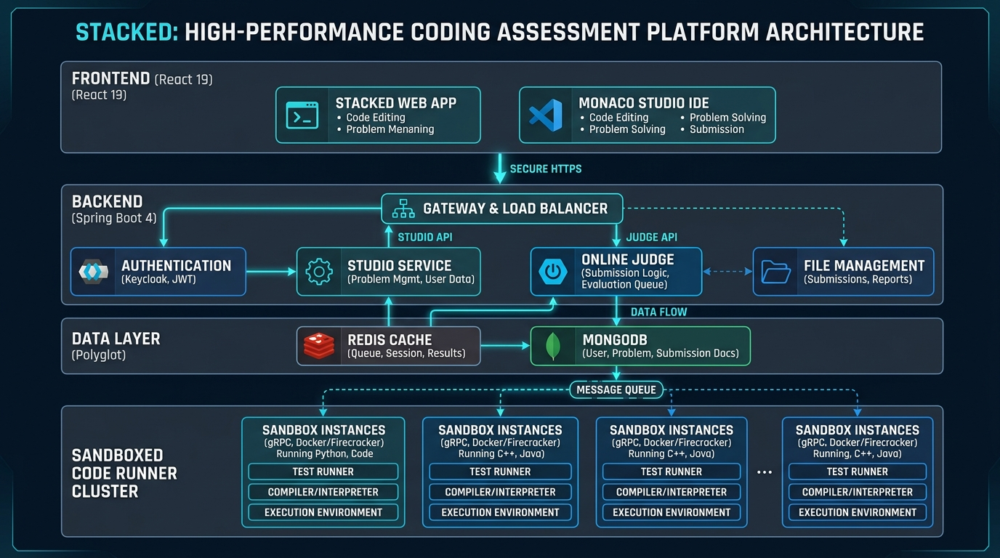
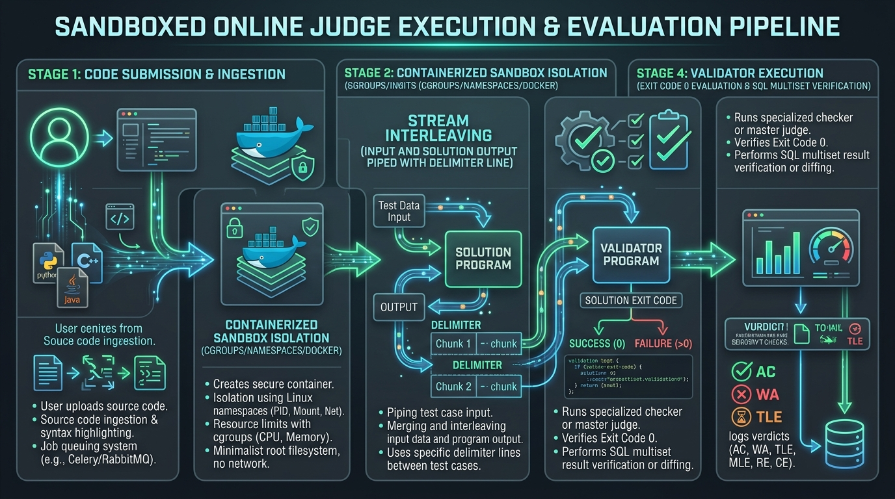

# Stacked Documentation Index

Comprehensive documentation for the **Stacked** High-Performance Coding Assessment & Online Judge Platform.

---

## Documentation Suites

| Document                                      | Purpose                                                                                                                | File Link                  |
| --------------------------------------------- | ---------------------------------------------------------------------------------------------------------------------- | -------------------------- |
| **Abstract**                                  | Executive summary, project background, motivation, core innovations, and technology overview.                          | [ABSTRACT.md](ABSTRACT.md) |
| **SRS (Software Requirements Specification)** | IEEE 830 compliant functional and non-functional requirements, interfaces, and traceability matrix.                    | [SRS.md](SRS.md)           |
| **HLD (High-Level Design)**                   | Architectural topology, subsystem decomposition, polyglot data strategy, threat modeling, and sequence flows.          | [HLD.md](HLD.md)           |
| **LLD (Low-Level Design)**                    | Class diagrams, Spring Boot services, MongoDB & Redis schemas, API contracts, frontend state machines, and algorithms. | [LLD.md](LLD.md)           |

---

## Architecture & Visual Assets

### 1. System Architecture

### 2. Coding Problem Studio IDE

### 3. Sandboxed Online Judge Execution Pipeline

