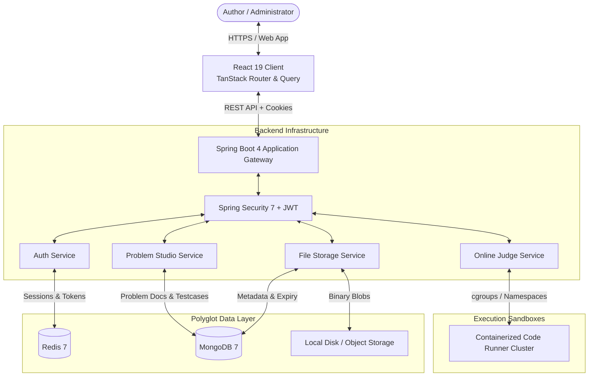
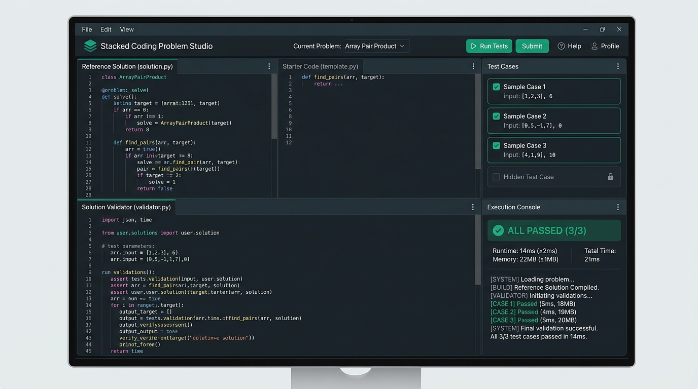

# Software Requirements Specification (SRS)

## Project: Stacked — High-Performance Coding Assessment & Online Judge Platform

**Document Version:** 1.0.0  
**Standard:** IEEE 830 / ISO/IEC/IEEE 29148 Compliant  
**Status:** Approved  
**Author:** Stacked Engineering Architecture Team

---

## 1. Introduction

### 1.1 Purpose

This document provides a formal and comprehensive specification of the functional, non-functional, and interface requirements for **Stacked**. It serves as the primary contractual and architectural reference for software engineers, QA testers, database administrators, system architects, and technical stakeholders.

### 1.2 Document Conventions

- Requirements are prioritized using MoSCoW methodology: **MUST** (Mandatory), **SHOULD** (High Priority), **COULD** (Desirable), and **WON'T** (Deferred).
- Identifiers follow the pattern:
  - `FR-<MODULE>-<NUMBER>` for Functional Requirements.
  - `NFR-<CATEGORY>-<NUMBER>` for Non-Functional Requirements.
  - `IF-<TYPE>-<NUMBER>` for Interface Requirements.

### 1.3 Intended Audience

- **Developers & Engineers**: To implement frontend components, backend REST services, and judge execution sandboxes.
- **System Architects**: To validate data flow, security boundaries, and scalability models.
- **QA Engineers**: To derive automated unit, integration, end-to-end, and performance test suites.
- **DevOps & SRE**: To configure container orchestration, Redis clusters, and MongoDB persistence.

### 1.4 Project Scope

Stacked is an enterprise-grade technical assessment ecosystem comprising:

1. **Administrative Studio**: A high-productivity, two-step workbench enabling authors to compose rich LaTeX-supported problem descriptions, curate dynamic sample testcases, author starter code templates, and establish verified reference solutions.
2. **Deterministic Solution Validator Engine**: A language-agnostic validation layer verifying algorithmic correctness via exit codes and relational result-set multiset comparisons.
3. **Isolated Code Runner**: A containerized sandbox executing untrusted code with rigid CPU, memory, process, and network egress boundaries.
4. **Secure Polyglot Backend**: Spring Boot 4 service integrating MongoDB for documents, Redis for session/token cache, and temporary-to-permanent file lifecycle tracking.

### 1.5 Definitions, Acronyms, and Abbreviations

| Term          | Definition                                                                    |
| ------------- | ----------------------------------------------------------------------------- |
| **AST**       | Abstract Syntax Tree                                                          |
| **Cgroups**   | Linux Control Groups (used for memory, CPU, and I/O resource limiting)        |
| **DDL / DML** | Data Definition Language / Data Manipulation Language                         |
| **HTTP-Only** | Cookie attribute preventing access via client-side JavaScript, mitigating XSS |
| **IDE**       | Integrated Development Environment                                            |
| **JWT**       | JSON Web Token (RFC 7519)                                                     |
| **KaTeX**     | Fast JavaScript LaTeX math typesetting library                                |
| **MoSCoW**    | Must have, Should have, Could have, Won't have (Prioritization)               |
| **RBAC**      | Role-Based Access Control                                                     |
| **SRS**       | Software Requirements Specification                                           |
| **TTL**       | Time-To-Live (Cache and ephemeral file expiration duration)                   |

---

## 2. Overall Description

### 2.1 Product Perspective

Stacked operates in a distributed client-server topology. The web application interacts with the backend REST API over HTTPS, while the backend orchestrates polyglot persistence and sandboxed code execution.

### 2.2 User Classes & Personas

1. **System Administrator (`ADMIN`)**:
   - Manages platform security, system configurations, and monitors worker cluster health.
   - Authorizes assessment problem libraries and manages organizational user credentials.
2. **Problem Author / Reviewer (`AUTHOR`)**:
   - Utilizes the **Coding Problem Studio** to design algorithmic and database challenges.
   - Authors markdown statements, embeds KaTeX math, creates testcases, and programs reference solutions and validators.
3. **Assessment Candidate (`CANDIDATE`)**:
   - Accesses live problem assessments, writes code solutions in the browser Monaco IDE, and executes sample tests and final submissions.
4. **Automated Judge Daemon (`SYSTEM`)**:
   - Receives submission payloads, loads test inputs, compiles code, runs test suites inside isolated cgroups, compares actual vs. expected outputs, and computes execution metrics.

### 2.3 Operating Environment

- **Client Platforms**: Modern evergreen browsers (Chrome 120+, Firefox 120+, Safari 17+, Edge 120+). Minimum resolution: 1280x720 (Desktop recommended for Studio IDE).
- **Backend Host**: Linux (Ubuntu 22.04 LTS / Debian 12 / RHEL 9), OpenJDK 25, 4+ CPU Cores, 8GB+ RAM.
- **Databases**: MongoDB 7.0+, Redis 7.2+.
- **Container Runtime**: Docker Engine 26+ / containerd for isolated worker sandboxes.

### 2.4 Design Constraints

- Backend MUST run on **Java 25** leveraging **Spring Boot 4.1.1** standard conventions.
- Frontend MUST be built on **React 19** with **Tailwind CSS v4** and `@base-ui/react` primitives.
- Code execution MUST be completely sandboxed with zero network access and maximum execution time thresholds.
- Step 2 IDE workspace MUST fit into the full viewport without triggering window scrollbars (`zero-scroll` architecture).

---

## 3. Specific System Requirements

### 3.1 External Interface Requirements

#### 3.1.1 User Interfaces

- **IF-UI-1 (Problem Studio Step 1)**: Single-column full-width form containing:
  - Title, URL-friendly Slug generator.
  - Difficulty selector with visual chromatic indicators (Easy: Emerald, Medium: Amber, Hard: Rose).
  - Problem Type selector (`GENERIC` vs `DATABASE`).
  - Supported language multiselect using flattened registry labels.
  - Split-view Markdown Editor with KaTeX preview, table formatting, and image insertion.
  - Testcases Section supporting input data / SQL init script authoring with case duplication and reordering.
- **IF-UI-2 (Problem Studio Step 2)**: Full-viewport zero-scroll IDE workbench featuring:
  - Top workbench toolbar with language pill tabs, readiness indicators, and Run Reference Solution trigger.
  - Left resizable vertical panel containing Reference Solution, Starter Code tabs, and Solution Validator script editor.
  - Right resizable vertical panel containing statement-synchronized testcase input editor and execution console.
- **IF-UI-3 (Admin Portal)**: Authentication screen with email/password input, CSRF handling, and authenticated navigation.

#### 3.1.2 Software Interfaces

- **IF-SW-1 (MongoDB Driver)**: Spring Data MongoDB connecting over URI `mongodb://${MONGO_HOST}:${MONGO_PORT}/${MONGO_DB}`.
- **IF-SW-2 (Redis Connection)**: Spring Data Redis with Lettuce connection pool over `redis://${REDIS_HOST}:${REDIS_PORT}`.
- **IF-SW-3 (Monaco Editor)**: `@monaco-editor/react` package bound to internal syntax models with automatic dark/light theme syncing.

---

### 3.2 Functional Requirements

#### Module 1: Authentication & Authorization

- **FR-AUTH-01 (Admin Credentials)**: The system MUST authenticate administrators via email and password using BCrypt password hashing.
- **FR-AUTH-02 (JWT Generation)**: Upon successful authentication, the server MUST issue an access JWT (15-minute expiration) and a refresh token (7-day expiration).
- **FR-AUTH-03 (HTTP-Only Refresh Cookie)**: The refresh token MUST be transmitted solely via secure, HTTP-only, SameSite cookies to protect against XSS token harvesting.
- **FR-AUTH-04 (Token Revocation / Blacklist)**: When an administrator logs out, the access token JTI MUST be added to a Redis revocation set with a TTL matching the token's remaining lifespan.
- **FR-AUTH-05 (Auto-Initialization)**: If no administrator exists on startup, `AdminUserInitializer` MUST provision a default admin account from environment configuration.

#### Module 2: Coding Problem Studio

- **FR-STUDIO-01 (Step 1 Validation)**: The studio MUST validate problem title, slug uniqueness (regex `^[a-z0-9-]+$`), difficulty, category, and minimum of 1 testcase before advancing to Step 2.
- **FR-STUDIO-02 (Compiler Registry)**: The system MUST supply a flattened compiler list embedding runtime versions (e.g. `Java (OpenJDK 21)`, `C++ (GCC 13.2)`, `Python (CPython 3.12)`, `MySQL (8.0)`).
- **FR-STUDIO-03 (Starter & Reference Sync)**: In Step 2, modifying starter code templates MUST automatically sync with unedited reference solutions. A "Reset to Starter" button MUST be provided.
- **FR-STUDIO-04 (Publish Enforcement)**: The studio MUST reject publishing if any selected language lacks either a reference solution or a validator script.

#### Module 3: Rich Markdown & Math Engine

- **FR-MD-01 (KaTeX Rendering)**: The markdown preview MUST parse inline LaTeX math (`$...$` or `\(...\)`) and display block equations (`$$...$$` or `\[...\]`).
- **FR-MD-02 (Syntax Highlighting)**: Code blocks embedded in markdown MUST render with syntax highlighting across supported languages via `highlight.js`.
- **FR-MD-03 (Live Split Preview)**: Authors MUST be able to toggle between edit-only, preview-only, and synchronized split-view modes.

#### Module 4: Ephemeral & Permanent File Lifecycle

- **FR-FILE-01 (Temporary Image Upload)**: Images pasted or uploaded into the Markdown editor MUST be saved immediately with an expiration timestamp (`expiresAt = now() + 24h`).
- **FR-FILE-02 (Image Tracking)**: The client application MUST track all uploaded file IDs associated with the current authoring session.
- **FR-FILE-03 (Permanent Promotion)**: When a problem is saved/published, all tracked images embedded in the statement MUST be transitioned to `storageType = PERMANENT` (`expiresAt = null`).
- **FR-FILE-04 (Automated Cleanup)**: The `FileCleanupScheduler` MUST execute every hour, identifying expired files in MongoDB, deleting physical blobs from disk/storage, and pruning database records.

#### Module 5: Online Judge & Code Execution

- **FR-JUDGE-01 (Sample Execution)**: Authors MUST be able to trigger test runs of their reference solution against configured testcases directly in Step 2.
- **FR-JUDGE-02 (Metrics Capture)**: Execution results MUST include Wall-clock Runtime (ms), Peak Memory Usage (MB), Output generated, and Validator logs.
- **FR-JUDGE-03 (Dual-Stream Delimiter Protocol)**: For generic languages, the runner MUST pipe standard input and candidate output into the validator separated by `\n---OUTPUT---\n`.
- **FR-JUDGE-04 (Verdict Classification)**: The runner MUST classify outcomes into: `Accepted (AC)`, `Wrong Answer (WA)`, `Time Limit Exceeded (TLE)`, `Memory Limit Exceeded (MLE)`, `Runtime Error (RE)`, `Compilation Error (CE)`.

#### Module 6: Database Validation Engine

- **FR-DB-01 (Order-Insensitive Validation)**: In multiset mode, the system MUST compute canonical frequency maps of result set rows and assert identical multiset equality.
- **FR-DB-02 (Order-Sensitive Validation)**: In strict mode, the system MUST verify identical sequence and row cardinality between candidate and reference queries.
- **FR-DB-03 (Custom SQL Assertion)**: In custom assertion mode, the system MUST execute an author-provided SQL script that returns an assertion boolean or row count to confirm schema validity.

---

## 4. Non-Functional Requirements

### 4.1 Performance Requirements

- **NFR-PERF-01 (API Response Time)**: 95% of non-execution API requests (problem metadata, auth, file fetch) MUST complete within **150 milliseconds** under a baseline load of 200 req/sec.
- **NFR-PERF-02 (Sample Run Latency)**: Sample test executions for interpreted scripts (Python, JS) MUST return verdicts within **800 milliseconds** (excluding user code execution time).
- **NFR-PERF-03 (Frontend Render FPS)**: Monaco Editor typing and Markdown split-view rendering MUST sustain **60 frames per second** with no detectable main-thread blocking.

### 4.2 Security Requirements

- **NFR-SEC-01 (Container Sandboxing)**: User submitted code MUST execute inside non-root containers with dropped Linux capabilities (`CAP_DROP=ALL`), disabled networking (`--net=none`), and read-only root filesystems.
- **NFR-SEC-02 (Resource Capping)**: Sandbox processes MUST be constrained to a hard memory limit (default 256MB) and CPU ceiling (default 1.0 vCPU) using Linux cgroups v2.
- **NFR-SEC-03 (Path Traversal Protection)**: File uploads MUST sanitize stored filenames with UUID prefixes and validate MIME types against strict allowlists (JPEG, PNG, WebP, SVG).
- **NFR-SEC-04 (CORS / CSRF)**: The REST API MUST restrict allowed origins to trusted client hosts with authenticated credentials.

### 4.3 Reliability & Availability

- **NFR-REL-01 (Database Redundancy)**: All core business data MUST be stored in MongoDB replica sets with write concern `majority`.
- **NFR-REL-02 (Automated Test Coverage)**: Backend code MUST pass end-to-end integration test suites utilizing live Testcontainers (MongoDB and Redis containers).

---

## 5. Requirements Traceability Matrix

| Requirement ID     | Component / Module               | Target Verification Method                                   |
| ------------------ | -------------------------------- | ------------------------------------------------------------ |
| `FR-AUTH-01..05`   | `com.bharath.stacked.security`   | Integration Tests (`AuthServiceImplTest`, Testcontainers)    |
| `FR-STUDIO-01..04` | `client/src/components/studio`   | Frontend Component & E2E Validation (`studio.tsx`)           |
| `FR-MD-01..03`     | `client/src/components/markdown` | Visual & Unit Testing (`markdown-preview.tsx`)               |
| `FR-FILE-01..04`   | `modules.file`                   | Integration & Unit Tests (`FileCleanupSchedulerTest`)        |
| `FR-JUDGE-01..04`  | `modules.judge`                  | Execution Pipeline Unit Tests (`TestcaseRunnerTest`)         |
| `FR-DB-01..03`     | `modules.judge`                  | Relational Query Assertion Tests (`SqlEvaluatorTest`)        |
| `NFR-SEC-01..04`   | Infrastructure & Security Filter | Security Audits, Pen-testing & Container Policy Verification |
